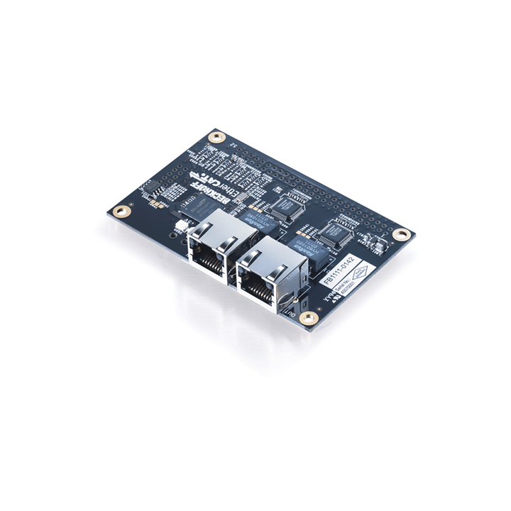

# ROS2 EtherCAT Digital Input/Output Module Test Project

### Prerequisites
1. [`FB1111-0142`](https://www.beckhoff.com/ko-kr/products/i-o/ethercat-development-products/elxxxx-etxxxx-fbxxxx-hardware/fb1111.html) EtherCAT piggyback controller board with ET1100 and digital I/O interface
    <p style="text-align:center"></p>
2. ROS2 (humble or iron)
3. [ros2_control](https://control.ros.org/iron/index.html)
4. PREEMPT_RT Linux Kernel (5.x)
5. [IgH EtherCAT Master](https://gitlab.com/etherlab.org/ethercat)
6. [EtherCAT Driver ROS2 Stack](https://icube-robotics.github.io/ethercat_driver_ros2/)

Helpful article: [EtherCAT Master 환경 구축 - Ubuntu 22.04 LTS + PREEMPT_RT 커널 패치](https://yogyui.tistory.com/entry/SBC-EtherCAT-Master-환경-구축-Ubuntu-2204-LTS-PREEMPTRT-커널-패치)

### Notice
- Tested ROS2 Version: `humble` and `iron`
- Reference articles
    - [ROS2 EtherCAT Beckhoff Digital I/O Slave 구동 예제](https://yogyui.tistory.com/entry/ROS2-EtherCAT-Beckhoff-Digital-IO-Slave-구동-예제)
    - [ROS2 EtherCAT Digital I/O Slave (FB1111-0142) 예제 - Input 읽기 추가](https://yogyui.tistory.com/entry/ROS2-EtherCAT-Digital-IO-Slave-FB1111-0142-예제-Input-읽기-추가)

### Install
```shell
$ mkdir -p ~/ros2_ws/src & cd ~/ros2_ws/src
$ git clone https://github.com/YOGYUI/ros2_ethercat_example_gpio.git
$ colcon build --packages-select ros2_ethercat_example_gpio --symlink-install
```

### Run
```shell
$ ros2 launch ros2_ethercat_example_gpio init.launch.py
```
